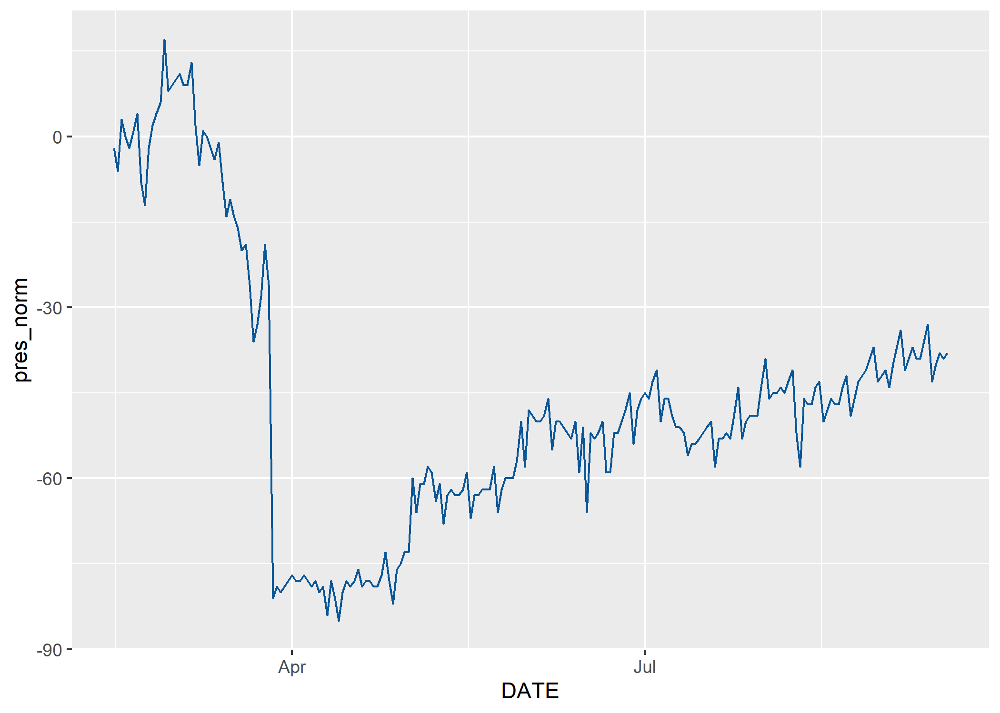
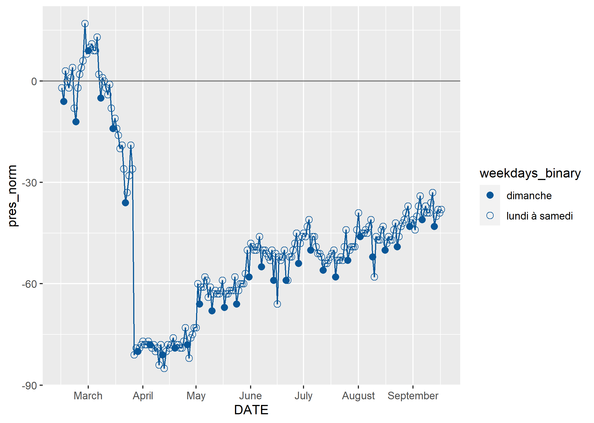

  

```{r setup, include=FALSE}

knitr::opts_chunk$set(echo = TRUE)
rm(list = ls()) # clean the workspace, i.e. data loaded in R
setwd("C:/Users/Xaviervollenweider/Documents/Flowminder/COVID/DRC/hand_over/")
```

## Introduction
Cette page fournit une première introduction à la visualisation des indicateurs de mobilité dérivés des enregistrements détaillés des appels (ci-après CDRs, de l'anglais *Call detail records*). Après un bref survol de la natures des données CDR, nous présentons un script R pour visualiser les résultats. R est un logiciel d'analyse statistique open-source et gratuit permettant le traitement de données, leur analyse et le développement de visualisation et de tableaux de bord (dashboard). 
 
Ce travail s'inscrit dans le cadre de la collaboration entre la Fondation Flowminder, Vodacom Congo et Africell RDC pour soutenir la riposte of COVID-19.^[Ce travail a été réalisé avec le soutien financier de la Division Sécurité Humaine du Département Fédéral des Affaires Étrangères de la Confédération Suisse et du Programme de Matrice de Suivi de Déplacement de la mission l’Organisation Mondiale pour les Migrations en RDC. Le contenu de cette page relève de la seule responsabilité de la Fondation Flowminder et ne reflète pas nécessairement les vues de la Confédération Suisse ou de l’Organisation Mondiale pour la Migration.]

## Prérequis
L’installation de R est nécessaire pour utiliser les codes qui sont présentés sur cette page. Rstudio est l'interface utilisateur le plus communément utilisé pour programmer en R.  Voici [le lien](https://rstudio.com/products/rstudio/download/#download) pour installer R et Rstudio. 

Une compréhension de base de l’environnement R est également requise. 

*   [ce tutoriel](https://cengel.github.io/R-intro/) offre une brève introduction à R.
*   [celui-ci](https://cengel.github.io/R-data-wrangling/) est une introduction à la manipulation des données,
*   [celui-ci](https://cengel.github.io/R-spatial/) est une introduction à l'utilisation des données spatiales,
*   [celui-ci](https://cengel.github.io/R-data-viz/) à la visualisation des données

    

## Bref aperçu des données CDRs
Les données CDRs sont probablement la meilleure source d’information sur la mobilité de la population en RDC. Leurs principaux avantages de ces données sont: 

*    d’être générées automatiquement.
*    de contenir des milliards de points provenant de millions de personnes, il y a donc une grandes échelles géographiques et temporelles couvertes.
*    d’être un flux continu, presque en temps réel.
*    d’être collectées mécaniquement - purement factuelles, sans biais liés à des processus d’interview comme dans les enquêtes de ménages classique.


Néanmoins, les données CDRs ne donnent qu'un aperçu de la mobilité de la population car elles ne portent que sur les abonnés d'un opérateur de réseau mobile (ORM) donné. L'une des limitation est donc qu'e 'une carte de SIM ne correspond pas forcément à une personne :

*   1 personne -> 0 carte de SIM: certaines personnes n'ont pas de carte SIM de l'ORM en question: elles utilisent un autre ORM, il n' y pas de couverture réseau, ou pour des facteurs socio-économique (par exemple la pauvreté ou l'âge)
*   1 personne -> plusieurs carte de SIM: certaines personnes ont plusieurs carte SIM de différents ORMs (par exemple l'une pour les appels, l'autre pour utiliser internet)
*   plusieurs personnes -> 1 carte de SIM: certaines personnes partagent leur SIM au sein du foyer

De plus, les données CDRs ne sont générées que pour les utilisateurs *actifs*, c'est à dire uniquement quand un abonné passe ou reçoit un appel, envoie ou reçoit un SMS ou utilise des données mobiles. Par exemple, si un abonné n'utilise que deux fois son téléphone dans la journée, il n'y aura que deux localisations dans les données CDR.


```{r tower_fig, out.width = '80%', echo=FALSE}
knitr::include_graphics("img/tower.png")
```

Comme les CDRs ne contiennent des informations que si les abonnés sont actifs, la précision de la localisation peut varier grandement d'un abonné à l'autre. Par exemple, la personne (1) sur le graphique ci-dessous est actifs tous les jours si bien qu'il peut être localisé chaque jour. Par contre, la personne 2 n'est active que le lundi et le vendredi: les CDRs ne contiennent aucune information sur sa localisation les autres jours.

```{r fig-time,out.width = '80%', echo=FALSE}
knitr::include_graphics("img/time_resolution.png")
```

De plus, la précision géographique des CDRs dépends de la distribution des antennes relais: la localisation d'un abonné ne se fait qu'au niveau de l'antenne relais. Dans certaines villes, on peut compter une antenne relais tous les 200 mètres. Dans les zones rurales, il peut n' y en avoir que une pour des dizaine de kilomètres carrés. La précision géographique dépend donc de la distribution des antennes relais à travers le territoire. 

```{r fig-spat,fig.cap="La résolution spatiale des CDRs dépend dépend de la distribution géographique des antennes relais.", out.width = '30%', echo=FALSE}
knitr::include_graphics("img/spatial_resolution.png")
```

En dernier lieu, un appel ou un SMS ne va pas forcément être acheminé par l'antenne relais la plus proche: le traffic peut être réorienté vers une autre antenne si la plus proche n'a pas la capacité de la gérer.  


## Le traitement des données CDRs, un maillon de la chaîne d’information
Les donnée CDR sont utiles qu’une fois comprise comme un des nombreux maillons de la chaìne d’information. Le diagramme suivant l’illustre sous la forme d’un cycle. 
```{r fig-value_chain,fig.cap="Cycle de valeurs des données CDRs", out.width = '80%', echo=FALSE}
knitr::include_graphics("img/value_chain.png")
```
Tout commence avec un besoin d’information. Dans le cas présent, la Task Force Présidentielle demande des informations sur la mobilité de la population afin de disposer d’évaluer l’efficacité des mesures pour contenir la Covid-19.

Les opérateurs de réseaux mobiles disposent de données bruts, les CDRs, qui doivent être traitées de façon sécurisées tout en préservant la confidentialité des données des abonnés. Le résultats de ce traitement sont des agrégats et des indicateurs de mobilité. 

Ceux-ci doivent ensuite être mis en perspective avec des données tierces, ne serait-ce que la délimitation des zones de santés. Une fois ces résultats intermédiaire produits, ils doivent être interprété et visualisé afin d’en extraire les messages clés. Une connaissance fine du contexte est requise pour ce faire. En dernier lieu, ces visualisations et messages doivent parvenir aux preneurs de décisions de façon transparente et sans occulter les limitations de ces résultats. Ils ne seront que l’un des nombreux paramètres pris en compte par les preneurs de décision. Ces derniers seront en mesures de préciser leurs besoins d’information afin que le processus décrit ici se répète, améliorant ainsi la qualité des informations qu’ils reçoivent.


## Des CDRs à un indicateur du nombre d'abonnés actifs dans chaque zone de santé
Flowminder a fourni à Africell des requêtes SQL pour qui produisent les agrégats CDR à partir des données CDR brutes. Bien que ces agrégats n'exposent aucune information sur les abonnés individuels, ils contiennent des informations qui peuvent être considérées comme commercialement sensibles, y compris le nombre d'abonnés vus dans une région. En traitant les données et en combinant plusieurs agrégats, nous pouvons produire des indicateurs de mobilité qui ne contiennent aucune information commercialement sensible. 

Nous présentons ci-deouss les étapes principales du processus.

### Étape 1: Africell produit l'agrégat ‘nombre_d'abonnés_par_zone_de_santé_par_jour’.

*Données requises*: 

*   Données CDR avec les champs *msisdn*, *date*, *localité* (ces données sont uniquement vue par Africell, personne d'autre n'y a accès) 
*   Fichier géographique (par exemple un *shapefile*) des zones de santé

Ceci est la carte des zones de santé:
```{r sp-plot-display-intro, fig.cap="Zones de santé en RDC ", out.width = '30%', echo=FALSE}
knitr::include_graphics("img/hz.png")
```

La table ci-dessous donne un exemple d'un fichier de CDR pour les appels et les sms. Les six champs de données sont:

*   MSISDN: l'identifiant de l'abonné qui initie l'appel ou le sms (*Mobile Station International Subscriber Directory Number").
*   MSISDN_COUNTERPART: l'identifiant de l'abonné qui reçoit l'appel ou le sms 
*   CELL_ID: l'identifiant de la cell par lequel l'appel a été initié (source)
*   REGION: la région géographique définie selon les régions commerciale de chaque ORM
*   EVENT_TYPE: appel (*voice*) ou sms
*   TIMESTAMP: la date et l'heure (horodatage)
   
```{r fig-cdr,fig.cap="Exemple de données CDRs (les chiffres montrés ci-dessus sont faut)", out.width = '80%', echo=FALSE}
knitr::include_graphics("img/cdr.png")
```

La requête SQL est disponible [ici](https://github.com/Flowminder/COVID-19/blob/d25c51841584dcedacf1c074ce80ead0e927890a/count_subscribers.sql#L5) et reproduite ci-dessous:

```{sql presence, eval=F}
CREATE TABLE count_subscribers_per_locality_per_day AS (

    SELECT * FROM (
        SELECT calls.call_date AS visit_date,
            cells.locality AS locality,
            count(DISTINCT msisdn) AS subscriber_count
        FROM calls
        INNER JOIN cells
            ON calls.location_id = cells.cell_id
        WHERE calls.call_date >= '2020-02-01'
            AND calls.call_date <= CURRENT_DATE
        GROUP BY visit_date, locality
    ) AS grouped
    WHERE grouped.subscriber_count > 15

);
```
Africell a classifier les antennes de relais en fonction des zones de santé et a adapté la requête SQL ci-dessus aux particularité de son systeme.

*Résultat*: 
Un tableau contenant les colonnes date, zone de santé, nombre de MSISDN uniques. Voir l'exemple ci-dessous, qui contient de fausses données.
Ce tableau n'est vu que par Africell et Flowminder. 


```{r fig-agg,fig.cap="(les chiffres montrés ci-dessus sont faut)", out.width = '50%', echo=FALSE}
knitr::include_graphics("img/presence_aggregat.png")
```


### Étape 2: Convertir le nombre d'abonnés en pourcentage par rapport au nombre médian pendant la période référence.
Cela empêche la divulgation d'informations commercialement sensibles sur le nombre d'abonné tout en permettant toujours de transmettre des informations précieuses et pertinentes.

Nous considérons la période de référence comme la période de quatre semaines précédant immédiatement l'introduction de tout restrictions de mobilité du gouvernement. Voir l'exemple ci-dessous, qui contient de fausses données. 

La période de réference et d'analyse est résumée sur le schema suivant.

```{r fig-timeline,fig.cap="(les chiffres montrés ci-dessus sont faut)", out.width = '50%', echo=FALSE}
knitr::include_graphics("img/timeline.png")
```

*Résultat*: 
Un tableau contenant les colonnes date, zone de santé, le nombre de MSISDN uniques exprimé en % changement par rapport à la période de référence. Voir l'exemple ci-dessous, qui contient de fausses données.

Par exemple, la ligne 2 signale que à la Gombe le 1er janvier 2020, il y avait 10% de plus de MSISDN uniques que durant la période de référence.
```{r fig-ind,fig.cap="(les chiffres montrés ci-dessus sont faut)", out.width = '50%', echo=FALSE}
knitr::include_graphics("img/presence_perc.png")
```
Sous réserve de l'autorisation explicite de Africell, ce tableau peut être vu par des tierces parties. 

### Étape 3: Ces informations sont ensuite présentées graphiquement.
Examiner comment le pourcentage relatif d'abonnés dans une localité a changé, pendant et après les périodes où des restrictions de mobilité sont en place, indique l'effet que les restrictions ont. Nous présentons ci-dessous le code requis pour cette visualisation.


```{r data-load, message=FALSE, warning=FALSE}
presence_or=read.csv("data/africell/afri_pres_kin_norm.csv") # read the csv file
```

```{r table-load, message=FALSE, warning=FALSE}
dim(presence_or) # montre le nombre de lignes et de colonnes.
head(presence_or) # montre les première lignes et de colonnes.
```
 
 
 
```{r sp-load, message=FALSE, warning=FALSE}
library(rgdal)
hz_or=readOGR("data/poly/healthzones_adm1.shp")
```

```{r hz-names, message=FALSE, warning=FALSE}
names(hz_or)
```

```{r hz-dim, message=FALSE, warning=FALSE}
dim(hz_or)
```


```{r sp-plot-save, echo=FALSE, message=FALSE, warning=FALSE,cache=T,results='hide'}
png("img/hz.png")
plot(hz_or)
dev.off()
```

```{r sp-plot-code, eval=F,message=FALSE, warning=FALSE}
plot(hz_or)
```

```{r sp-plot-display, fig.cap="Zones de santé en RDC ", out.width = '30%', echo=FALSE}
knitr::include_graphics("img/hz.png")
```

```{r join-sp-table, message=FALSE, warning=FALSE}
library(dplyr)
presence=presence_or%>%
  left_join(hz_or@data%>%
              select(F_id,name,ADM1_FR),
            by="F_id")%>%
  mutate(DATE=as.Date(DATE))
```

```{r timeline_1, message=FALSE, warning=FALSE}
library(ggplot2)
g=ggplot()+
  geom_line(data=presence%>%
              filter(name=="Gombe"),
            aes(x = DATE, 
                y = pres_norm,
                group=name),
            colour="#095798")
```

```{r timeline_1-save, echo=FALSE, message=FALSE, warning=FALSE,results='hide',cache=T}
ggsave(plot=g,
       "img/timeline_1.png")
```

```{r plot-code-1, eval=F,message=FALSE, warning=FALSE}
g
```

```{r plot-display-1, out.width = '70%', echo=FALSE}

```


```{r plot-code-2, message=FALSE, warning=FALSE}
g=g+scale_x_date(date_breaks = "month",
                 date_labels = "%B")
```

```{r plot-save-2, echo=FALSE, message=FALSE, warning=FALSE,results='hide',cache=T}
ggsave(plot=g,
       "img/timeline_2.png")
```

```{r plot-display-code-2, eval=F,message=FALSE, warning=FALSE}
g
```

```{r plot-display-2, out.width = '70%', echo=FALSE}
knitr::include_graphics("img/timeline_2.png")
```


```{r plot-code-3, message=FALSE, warning=FALSE}
g=g+geom_hline(yintercept = 0, colour = "grey50") 
```

```{r plot-save-3, echo=FALSE, message=FALSE, warning=FALSE,results='hide',cache=T}
ggsave(plot=g,
       "img/timeline_3.png")
```

```{r plot-display-code-3, eval=F,message=FALSE, warning=FALSE}
g
```

```{r plot-display-3, out.width = '70%', echo=FALSE}
knitr::include_graphics("img/timeline_3.png")
```

```{r weekday-code, message=FALSE, warning=FALSE}
library(lubridate)                  # package to handle dates
presence=presence%>%
  mutate(wdays=wday(DATE,           # wday is a function taking the DATE as input ...
                    label = T,      # to transform a date in the day of the week, label=True -> day in word 
                    week_start=1),  # and the week start on the Monday
         weekdays_binary=ifelse(wdays=="Sun","dimanche","lundi à samedi") # create a binary variable: either "Sunday" or "Monday to Saturday"
         ) 
```

```{r plot-code-4, message=FALSE, warning=FALSE}
g=g+
  geom_point(data = presence%>%
               filter(name=="Gombe"),
             aes(x = DATE, 
                 y = pres_norm, 
                 group=name, 
                 shape=weekdays_binary),
             size=2.5,
            colour="#095798")+
  scale_shape_manual(values=c(16, 1))+
  scale_color_manual(values=c("#095798"))
  
```

```{r plot-save-4, echo=FALSE, message=FALSE, warning=FALSE,results='hide',cache=T}
ggsave(plot=g,
       "img/timeline_4.png")
```

```{r plot-display-code-4, eval=F,message=FALSE, warning=FALSE}
g
```

```{r plot-display-4, out.width = '70%', echo=FALSE}

```


```{r key-dates-code, out.width = '70%', echo=FALSE}
# key dates Gombe #####
events <- data.frame(
  date = c(
    lubridate::as_date("2020-03-18"), 
    lubridate::as_date("2020-04-06"),
    lubridate::as_date("2020-06-29")
  ),
  label = 1:3,
  type = c(
    "Premières mesures annoncées ",
    "Début du confinement de la Gombe ",
    "Déconfinement de la Gombe"
  ),
  vjust = c(0, 0, 0)
) %>%
  mutate(index = paste0(label, ") ", type))
dateCaption <- stringr::str_wrap(paste0("Dates clés: ", paste(events$index, collapse = "")), 100)
```

```{r key-dates-plot-code, out.width = '70%', echo=FALSE}
# key dates lines Kinshasa #####
key_dates_lines=geom_vline(data = events, 
                               aes(xintercept = date), linetype = "dashed", colour = "grey")

key_dates_labels=geom_label(
  data = events, aes(x = date, y = 15, label = label, vjust = vjust),
  label.r = unit(0, "mm"), label.size = unit(0, "mm"), fill = "#e9e3da"
)
```

```{r plot-code-5, message=FALSE, warning=FALSE}
g=g+
  key_dates_lines  +
  key_dates_labels +
  labs(
    x = "",
    y = "Pourcentage par rapport à la période de référence",
    shape= "Jour de la semaine:",
    subtitle =dateCaption,
    caption = "Sources de données: Africell RDC"
  )
```

```{r plot-save-5, echo=FALSE, message=FALSE, warning=FALSE,results='hide',cache=T}
ggsave(plot=g,
       "img/timeline_5.png")
```

```{r plot-display-code-5, eval=F,message=FALSE, warning=FALSE}
g
```

```{r plot-display-5, out.width = '100%', echo=FALSE}
knitr::include_graphics("img/timeline_5.png")
```
