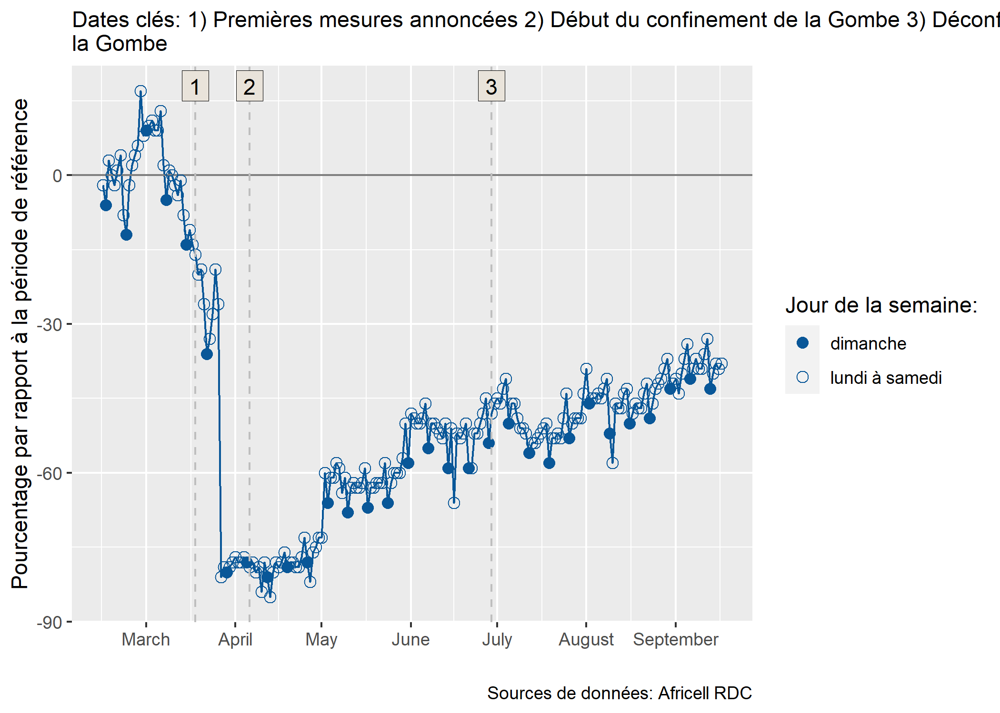

Introduction
------------

Cette page fournit une première introduction à la visualisation des
indicateurs de mobilité dérivés des enregistrements détaillés des appels
(ci-après CDRs, de l’anglais *Call detail records*). Après un bref
survol de la natures des données CDR, nous présentons un script R pour
visualiser les résultats. R est un logiciel d’analyse statistique
open-source et gratuit permettant le traitement de données, leur analyse
et le développement de visualisation et de tableaux de bord (dashboard).

Ce travail s’inscrit dans le cadre de la collaboration entre la
Fondation Flowminder, Vodacom Congo et Africell RDC pour soutenir la
riposte of COVID-19.[1]

Prérequis
---------

L’installation de R est nécessaire pour utiliser les codes qui sont
présentés sur cette page. Rstudio est l’interface utilisateur le plus
communément utilisé pour programmer en R. Voici [le
lien](https://rstudio.com/products/rstudio/download/#download) pour
installer R et Rstudio.

Une compréhension de base de l’environnement R est également requise.

-   [ce tutoriel](https://cengel.github.io/R-intro/) offre une brève
    introduction à R.
-   [celui-ci](https://cengel.github.io/R-data-wrangling/) est une
    introduction à la manipulation des données,
-   [celui-ci](https://cengel.github.io/R-spatial/) est une introduction
    à l’utilisation des données spatiales,
-   [celui-ci](https://cengel.github.io/R-data-viz/) à la visualisation
    des données

Bref aperçu des données CDRs
----------------------------

Les données CDRs sont probablement la meilleure source d’information sur
la mobilité de la population en RDC. Leurs principaux avantages de ces
données sont:

-   d’être générées automatiquement.
-   de contenir des milliards de points provenant de millions de
    personnes, il y a donc une grandes échelles géographiques et
    temporelles couvertes.
-   d’être un flux continu, presque en temps réel.
-   d’être collectées mécaniquement - purement factuelles, sans biais
    liés à des processus d’interview comme dans les enquêtes de ménages
    classique.

Néanmoins, les données CDRs ne donnent qu’un aperçu de la mobilité de la
population car elles ne portent que sur les abonnés d’un opérateur de
réseau mobile (ORM) donné. L’une des limitation est donc qu’e ’une carte
de SIM ne correspond pas forcément à une personne :

-   1 personne -&gt; 0 carte de SIM: certaines personnes n’ont pas de
    carte SIM de l’ORM en question: elles utilisent un autre ORM, il n’
    y pas de couverture réseau, ou pour des facteurs socio-économique
    (par exemple la pauvreté ou l’âge)
-   1 personne -&gt; plusieurs carte de SIM: certaines personnes ont
    plusieurs carte SIM de différents ORMs (par exemple l’une pour les
    appels, l’autre pour utiliser internet)
-   plusieurs personnes -&gt; 1 carte de SIM: certaines personnes
    partagent leur SIM au sein du foyer

De plus, les données CDRs ne sont générées que pour les utilisateurs
*actifs*, c’est à dire uniquement quand un abonné passe ou reçoit un
appel, envoie ou reçoit un SMS ou utilise des données mobiles. Par
exemple, si un abonné n’utilise que deux fois son téléphone dans la
journée, il n’y aura que deux localisations dans les données CDR.

Comme les CDRs ne contiennent des informations que si les abonnés sont
actifs, la précision de la localisation peut varier grandement d’un
abonné à l’autre. Par exemple, la personne (1) sur le graphique
ci-dessous est actifs tous les jours si bien qu’il peut être localisé
chaque jour. Par contre, la personne 2 n’est active que le lundi et le
vendredi: les CDRs ne contiennent aucune information sur sa localisation
les autres jours.

La résolution temporelle des CDRs de chaque abonné dépend de sa
fréquence d’utilisation du réseau mobile.

De plus, la précision géographique des CDRs dépends de la distribution
des antennes relais: la localisation d’un abonné ne se fait qu’au niveau
de l’antenne relais. Dans certaines villes, on peut compter une antenne
relais tous les 200 mètres. Dans les zones rurales, il peut n’ y en
avoir que une pour des dizaine de kilomètres carrés. La précision
géographique dépend donc de la distribution des antennes relais à
travers le territoire.

La résolution spatiale des CDRs dépend dépend de la distribution
géographique des antennes relais.

En dernier lieu, un appel ou un SMS ne va pas forcément être acheminé
par l’antenne relais la plus proche: le traffic peut être réorienté vers
une autre antenne si la plus proche n’a pas la capacité de la gérer.

Le traitement des données CDRs, un maillon de la chaîne d’information
---------------------------------------------------------------------

Les donnée CDR sont utiles qu’une fois comprise comme un des nombreux
maillons de la chaìne d’information. Le diagramme suivant l’illustre
sous la forme d’un cycle.

Cycle de valeurs des données CDRs

Tout commence avec un besoin d’information. Dans le cas présent, la Task
Force Présidentielle demande des informations sur la mobilité de la
population afin de disposer d’évaluer l’efficacité des mesures pour
contenir la Covid-19.

Les opérateurs de réseaux mobiles disposent de données bruts, les CDRs,
qui doivent être traitées de façon sécurisées tout en préservant la
confidentialité des données des abonnés. Le résultats de ce traitement
sont des agrégats et des indicateurs de mobilité.

Ceux-ci doivent ensuite être mis en perspective avec des données
tierces, ne serait-ce que la délimitation des zones de santés. Une fois
ces résultats intermédiaire produits, ils doivent être interprété et
visualisé afin d’en extraire les messages clés. Une connaissance fine du
contexte est requise pour ce faire. En dernier lieu, ces visualisations
et messages doivent parvenir aux preneurs de décisions de façon
transparente et sans occulter les limitations de ces résultats. Ils ne
seront que l’un des nombreux paramètres pris en compte par les preneurs
de décision. Ces derniers seront en mesures de préciser leurs besoins
d’information afin que le processus décrit ici se répète, améliorant
ainsi la qualité des informations qu’ils reçoivent.

Des CDRs à un indicateur du nombre d’abonnés actifs dans chaque zone de santé
-----------------------------------------------------------------------------

Flowminder a fourni à Africell des requêtes SQL pour qui produisent les
agrégats CDR à partir des données CDR brutes. Bien que ces agrégats
n’exposent aucune information sur les abonnés individuels, ils
contiennent des informations qui peuvent être considérées comme
commercialement sensibles, y compris le nombre d’abonnés vus dans une
région. En traitant les données et en combinant plusieurs agrégats, nous
pouvons produire des indicateurs de mobilité qui ne contiennent aucune
information commercialement sensible.

Nous présentons ci-deouss les étapes principales du processus.

### Étape 1: Africell produit l’agrégat ‘nombre\_d’abonnés\_par\_zone\_de\_santé\_par\_jour’.

*Données requises*:

-   Données CDR avec les champs *msisdn*, *date*, *localité* (ces
    données sont uniquement vue par Africell, personne d’autre n’y a
    accès)
-   Fichier géographique (par exemple un *shapefile*) des zones de santé

La table ci-dessous donne un exemple d’un fichier de CDR pour les appels
et les sms. Les six champs de données sont:

-   MSISDN: l’identifiant de l’abonné qui initie l’appel ou le sms
    (\*Mobile Station International Subscriber Directory Number").
-   MSISDN\_COUNTERPART: l’identifiant de l’abonné qui reçoit l’appel ou
    le sms
-   CELL\_ID: l’identifiant de la cell par lequel l’appel a été initié
    (source)
-   REGION: la région géographique
-   EVENT\_TYPE: appel (*voice*) ou sms
-   TIMESTAMP: la date et l’heure (horodatage)

Exemple de données CDRs (les chiffres montrés ci-dessus sont faut)

Et ceci est la carte des zones de santé:

Zones de santé en RDC

La requête SQL est disponible
[ici](https://github.com/Flowminder/COVID-19/blob/d25c51841584dcedacf1c074ce80ead0e927890a/count_subscribers.sql#L5)
et reproduite ci-dessous:

    CREATE TABLE count_subscribers_per_locality_per_day AS (

        SELECT * FROM (
            SELECT calls.call_date AS visit_date,
                cells.locality AS locality,
                count(DISTINCT msisdn) AS subscriber_count
            FROM calls
            INNER JOIN cells
                ON calls.location_id = cells.cell_id
            WHERE calls.call_date >= '2020-02-01'
                AND calls.call_date <= CURRENT_DATE
            GROUP BY visit_date, locality
        ) AS grouped
        WHERE grouped.subscriber_count > 15

    );

*Résultat*: Un tableau contenant les colonnes date, zone de santé,
nombre de MSISDN uniques. Voir l’exemple ci-dessous, qui contient de
fausses données. Cette tableau n’est vu que par Africell et Flowminder.

### Étape 2: Convertir le nombre d’abonnés en pourcentage par rapport au nombre médian pendant la période référence.

Cela empêche la divulgation d’informations commercialement sensibles sur
le nombre d’abonné tout en permettant toujours de transmettre des
informations précieuses et pertinentes.

Nous considérons la période de référence comme la période de quatre
semaines précédant immédiatement l’introduction de tout restrictions de
mobilité du gouvernement. Voir l’exemple ci-dessous, qui contient de
fausses données.

Étape 3: Ces informations sont ensuite présentées graphiquement.
Examiner comment le pourcentage relatif d’abonnés dans une localité a
changé, pendant et après les périodes où des restrictions de mobilité
sont en place, indique l’effet que les restrictions ont. Nous présentons
plus bas le code requis pour cette visualisation.

Africell a exécuté les requêtes SQL *open-source* de Flowminder afin de
produire des agrégats de mobilité utilisés plus tard par Flowminder pour
dériver les indicateurs de mobilité que nous visualiserons ci-dessous.
Les dépôt GitHub où sont stockées les requêtes SQL est disponible à [ce
lien](https://github.com/Flowminder/COVID-19/tree/c9b81d2af6404af2a5c78f0b71bcee9dcc867279).

Visualiser les indices de mobilité
----------------------------------

    presence_or=read.csv("data/africell/afri_pres_kin_norm.csv") # read the csv file

    dim(presence_or) # montre le nombre de lignes et de colonnes.

    ## [1] 7708    3

    head(presence_or) # montre les première lignes et de colonnes.

    ##                F_id       DATE pres_norm
    ## 1 relation/10704911 2020-02-01  3.420011
    ## 2 relation/10721872 2020-02-01  6.462922
    ## 3 relation/10720731 2020-02-01  5.479898
    ## 4 relation/10722139 2020-02-01  5.288341
    ## 5 relation/10650548 2020-02-01  4.357150
    ## 6 relation/10718886 2020-02-01  6.292042

    library(rgdal)
    hz_or=readOGR("data/poly/healthzones_adm1.shp")

    ## OGR data source with driver: ESRI Shapefile 
    ## Source: "C:\Users\Xaviervollenweider\Documents\Flowminder\COVID\DRC\hand_over\data\poly\healthzones_adm1.shp", layer: "healthzones_adm1"
    ## with 519 features
    ## It has 11 fields

    names(hz_or)

    ##  [1] "F_id"       "attributio" "boundary"   "health_lev" "name"      
    ##  [6] "ref"        "ref_dhis2"  "source"     "type"       "ADM1_FR"   
    ## [11] "ADM1_PCODE"

    dim(hz_or)

    ## [1] 519  11

    plot(hz_or)

Zones de santé en RDC

    library(dplyr)
    presence=presence_or%>%
      left_join(hz_or@data%>%
                  select(F_id,name,ADM1_FR),
                by="F_id")%>%
      mutate(DATE=as.Date(DATE))

    library(ggplot2)
    g=ggplot()+
      geom_line(data=presence%>%
                  filter(name=="Gombe"),
                aes(x = DATE, 
                    y = pres_norm,
                    group=name),
                colour="#095798")

    g

    g=g+scale_x_date(date_breaks = "month",
                     date_labels = "%B")

    g

    g=g+geom_hline(yintercept = 0, colour = "grey50") 

    g

    library(lubridate)                  # package to handle dates
    presence=presence%>%
      mutate(wdays=wday(DATE,           # wday is a function taking the DATE as input ...
                        label = T,      # to transform a date in the day of the week, label=True -> day in word 
                        week_start=1),  # and the week start on the Monday
             weekdays_binary=ifelse(wdays=="Sun","dimanche","lundi à samedi") # create a binary variable: either "Sunday" or "Monday to Saturday"
             ) 

    g=g+
      geom_point(data = presence%>%
                   filter(name=="Gombe"),
                 aes(x = DATE, 
                     y = pres_norm, 
                     group=name, 
                     shape=weekdays_binary),
                 size=2.5,
                colour="#095798")+
      scale_shape_manual(values=c(16, 1))+
      scale_color_manual(values=c("#095798"))

    g

    g=g+
      key_dates_lines  +
      key_dates_labels +
      labs(
        x = "",
        y = "Pourcentage par rapport à la période de référence",
        shape= "Jour de la semaine:",
        subtitle =dateCaption,
        caption = "Sources de données: Africell RDC"
      )

    g

[1] Ce travail a été réalisé avec le soutien financier de la Division
Sécurité Humaine du Département Fédéral des Affaires Étrangères de la
Confédération Suisse et du Programme de Matrice de Suivi de Déplacement
de la mission l’Organisation Mondiale pour les Migrations en RDC. Le
contenu de cette page relève de la seule responsabilité de la Fondation
Flowminder et ne reflète pas nécessairement les vues de la Confédération
Suisse ou de l’Organisation Mondiale pour la Migration.
