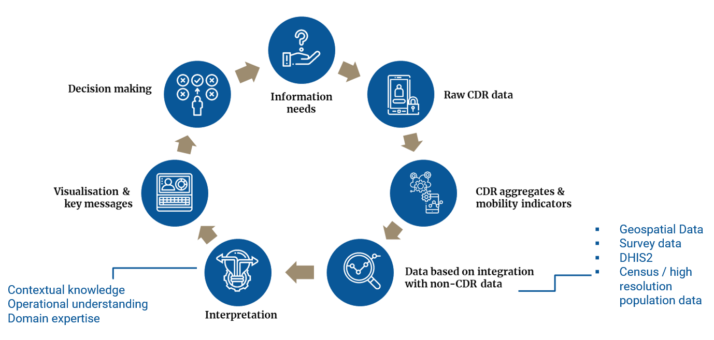
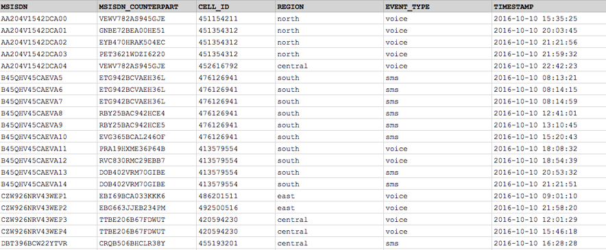
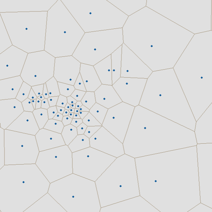
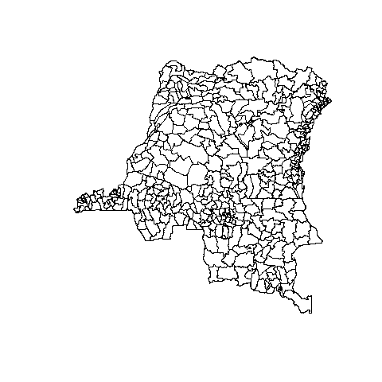
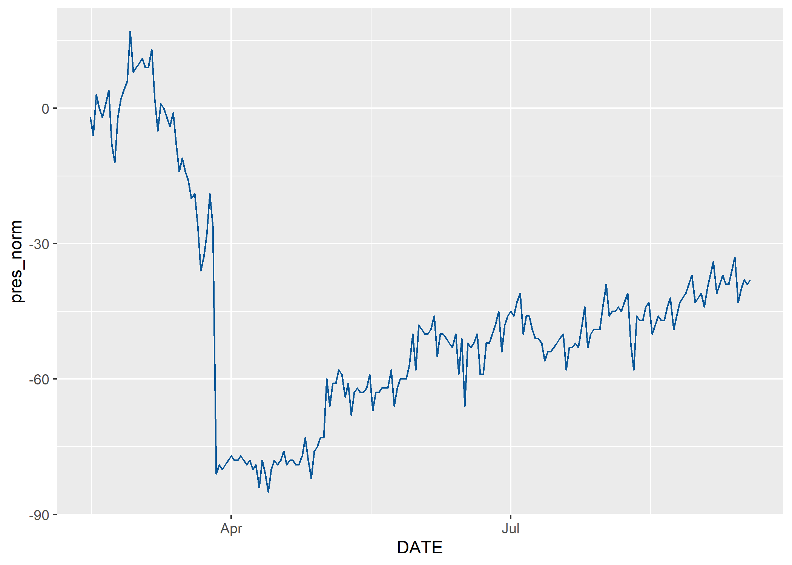
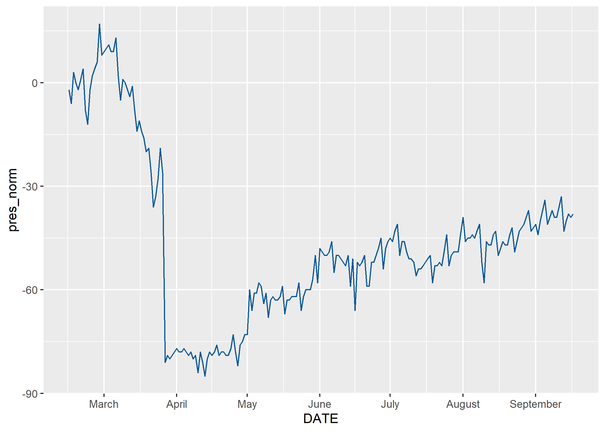
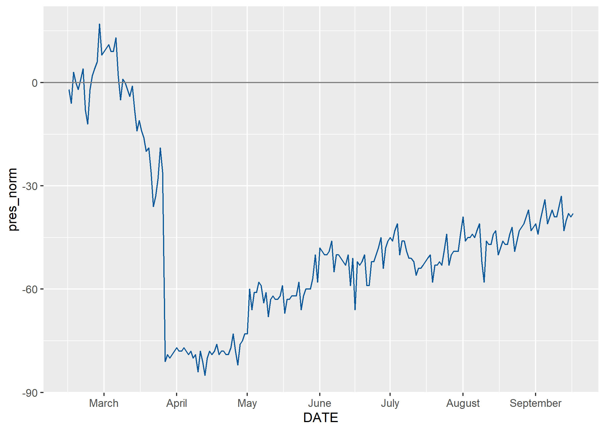
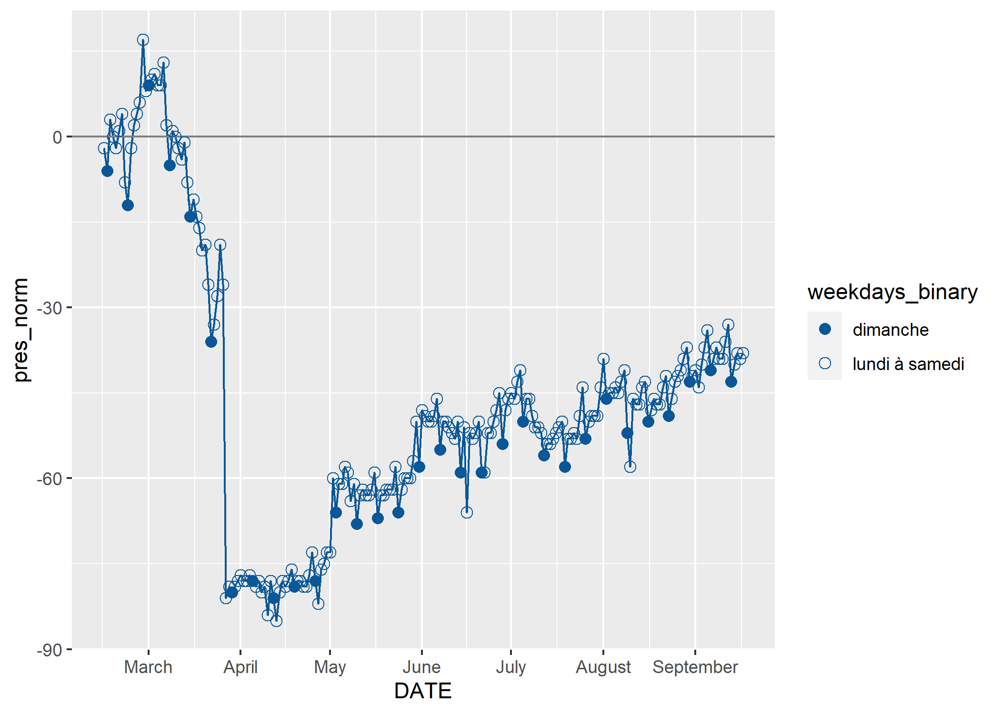

Prerequisites
-------------

R est un logiciel d’analyse statistique open-source et gratuit
permettant le traitement de données, leur analyse et le développement de
visualisation et de tableaux de bord (dashboard).Rstudio est l’interface
utilisateur le plus communément utilisé pour programmer en R.

Voici [le lien](https://rstudio.com/products/rstudio/download/#download)
pour installer R et Rstudio. [Ce
livre](https://cengel.github.io/R-intro/) en ligne gratuit offre une
brève introduction à R.

Voici plus de matériel du même auteur que le lien précédent:

-   ce [tutoriel](https://cengel.github.io/R-data-wrangling/) est une
    introduction à la manipulation des données,
-   ce [tutoriel](https://cengel.github.io/R-spatial/) est une
    introduction à l’utilisation des données spatiales,
-   et [celui-ci](https://cengel.github.io/R-data-viz/) à la
    visualisation des données

Introduction
------------

Cette page fournit une première introduction à la visualisation des
indicateurs de mobilité dérivés des enregistrements détaillés des appels
(ci-après CDRs, de l’anglais *Call detail records*). Après un bref
survol de la natures des données CDR, nous présentons un scripte R pour
visualiser. Ce travail s’incrit dans le cadre de la collaboration entre
la Fondation Flowminder, Vodacom Congo et Africell RDC pour soutenir la
riposte of COVID-19.[1]

Ces indicateurs de mobilité ont été produits par Africell RDC et la
Fondation Flowminder pour soutenir la réponse COVID-19 en RDC, avec le
soutien financier de la Division de la sécurité humaine, qui fait partie
du Département fédéral des affaires étrangères de la Confédération
suisse, ainsi que le déplacement Programme de matrice de suivi de
l’Organisation internationale pour les migrations (OIM) en République
démocratique du Congo (RDC).

Africell a exécuté les requêtes SQL *open-source* de Flowminder afin de
produire des agrégats de mobilité utilisés plus tard par Flowminder pour
dériver les indicateurs de mobilité que nous visualiserons ci-dessous.

Les dépôt GitHub où sont stockée les requêtes SQL est disponible à [ce
lien](https://github.com/Flowminder/COVID-19/tree/c9b81d2af6404af2a5c78f0b71bcee9dcc867279).

Bref aperçu des données CDRs
----------------------------

Cycle de valeurs des données CDRs

Les CDRs sont générés chaque fois qu’un abonné passe ou reçoit un appel,
envoie ou reçoit un SMS ou utilise des données mobiles. Sur l’exemple
ci-contre, il n’y aurait que deux localisations dans les données CDR
d’appels: un point à l’heure du déjeuné près du lieu de travail de
l’abonné, un point le soir près de son lieu de domicile.

Exemple de données CDRs (les chiffres montrés ci-dessus sont faut)

La résolution temporelle des CDRs de chaque abonné dépend de sa
fréquence d’utilisation du réseau mobile.

La résolution spatiale des CDRs dépend dépend de la distribution
géographique des antennes relais.

De la données brut (CDRs) à un indicateur de mobilité: Aperçu du processus
--------------------------------------------------------------------------

Le schéma ci-dessous présente les étapes clés du processus. Flowminder a
fourni à Africell des requêtes SQL qui produisent les agrégats CDR à
partir des données CDR brutes. Bien que ces agrégats n’exposent aucune
information sur les abonnés individuels, ils contiennent des valeurs qui
peuvent être considérées comme commercialement sensibles, y compris le
nombre d’abonnés vus dans une région. En traitant les données et en
combinant plusieurs agrégats, nous pouvons produire des indicateurs CDR
qui ne contiennent aucune information commercialement sensible. Une fois
que les indicateurs CDR ont été produits, ils sont conçus pour être
partagés en externe avec d’autres parties prenantes, qui peuvent les
utiliser dans leur propres analyses.

    presence_or=read.csv("data/africell/afri_pres_kin_norm.csv") # read the csv file

    dim(presence_or) # montre le nombre de lignes et de colonnes.

    ## [1] 7708    3

    head(presence_or) # montre les première lignes et de colonnes.

    ##                F_id       DATE pres_norm
    ## 1 relation/10704911 2020-02-01  3.420011
    ## 2 relation/10721872 2020-02-01  6.462922
    ## 3 relation/10720731 2020-02-01  5.479898
    ## 4 relation/10722139 2020-02-01  5.288341
    ## 5 relation/10650548 2020-02-01  4.357150
    ## 6 relation/10718886 2020-02-01  6.292042

    library(rgdal)
    hz_or=readOGR("data/poly/healthzones_adm1.shp")

    ## OGR data source with driver: ESRI Shapefile 
    ## Source: "C:\Users\Xaviervollenweider\Documents\Flowminder\COVID\DRC\hand_over\data\poly\healthzones_adm1.shp", layer: "healthzones_adm1"
    ## with 519 features
    ## It has 11 fields

    names(hz_or)

    ##  [1] "F_id"       "attributio" "boundary"   "health_lev" "name"      
    ##  [6] "ref"        "ref_dhis2"  "source"     "type"       "ADM1_FR"   
    ## [11] "ADM1_PCODE"

    dim(hz_or)

    ## [1] 519  11

    plot(hz_or)

Zones de santé en RDC

    library(dplyr)
    presence=presence_or%>%
      left_join(hz_or@data%>%
                  select(F_id,name,ADM1_FR),
                by="F_id")%>%
      mutate(DATE=as.Date(DATE))

    library(ggplot2)
    g=ggplot()+
      geom_line(data=presence%>%
                  filter(name=="Gombe"),
                aes(x = DATE, 
                    y = pres_norm,
                    group=name))

    g

    g=g+scale_x_date(date_breaks = "month",
                     date_labels = "%B")

    g

    g=g+geom_hline(yintercept = 0, colour = "grey50") 

    g

    library(lubridate)                  # package to handle dates
    presence=presence%>%
      mutate(wdays=wday(DATE,           # wday is a function taking the DATE as input ...
                        label = T,      # to transform a date in the day of the week, label=True -> day in word 
                        week_start=1),  # and the week start on the Monday
             weekdays_binary=ifelse(wdays=="Sun","dimanche","lundi à samedi") # create a binary variable: either "Sunday" or "Monday to Saturday"
             ) 

    g=g+
      geom_point(data = presence%>%
                   filter(name=="Gombe"),
                 aes(x = DATE, 
                     y = pres_norm, 
                     group=name, 
                     shape=weekdays_binary),
                 size=2.5)+
      scale_shape_manual(values=c(16, 1))

    g

[1] Ce travail a été réalisé avec le soutien financier de la Division
Sécurité Humaine du Département Fédéral des Affaires Étrangères de la
Confédération Suisse et du Programme de Matrice de Suivi de Déplacement
de la mission l’Organisation Mondiale pour les Migrations en RDC. Le
contenu de cette page relève de la seule responsabilité de la Fondation
Flowminder et ne reflète pas nécessairement les vues de la Confédération
Suisse ou de l’Organisation Mondiale pour la Migration.
