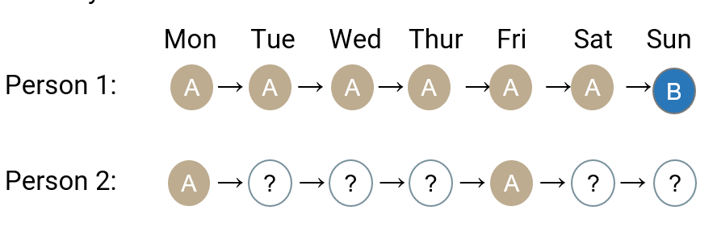
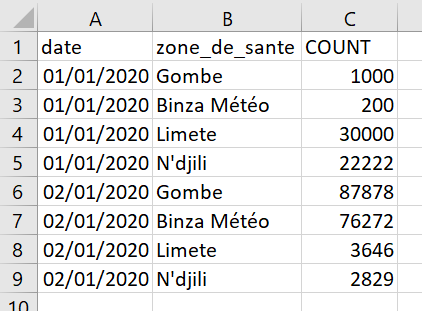
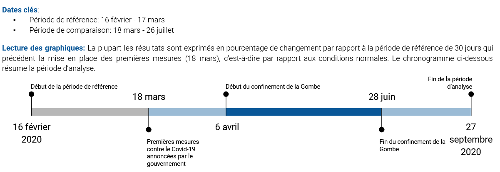
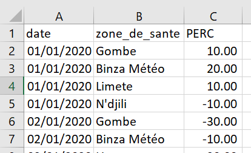

Introduction
------------

Cette page fournit une première introduction à la visualisation des
indicateurs de mobilité dérivés des enregistrements détaillés des appels
(ci-après CDRs, de l’anglais *Call detail records*). Après un bref
survol de la natures des données CDR, nous présentons un script R pour
visualiser les résultats. R est un logiciel d’analyse statistique
open-source et gratuit permettant le traitement de données, leur analyse
et le développement de visualisation et de tableaux de bord (dashboard).

Ce travail s’inscrit dans le cadre de la collaboration entre la
Fondation Flowminder, Vodacom Congo et Africell RDC pour soutenir la
riposte of COVID-19.[1]

Nous donnones l’exemple de la visualisation du nombre d’abonnés à la
Gombe. Examiner comment le pourcentage relatif d’abonnés dans la Gombe a
changé, pendant et après les périodes où des restrictions de mobilité
sont en place, indique l’effet que les restrictions ont.

Prérequis
---------

L’installation de R est nécessaire pour utiliser les codes qui sont
présentés sur cette page. Rstudio est l’interface utilisateur le plus
communément utilisé pour programmer en R. Voici [le
lien](https://rstudio.com/products/rstudio/download/#download) pour
installer R et Rstudio.

Une compréhension de base de l’environnement R est également requise.

-   [ce tutoriel](https://cengel.github.io/R-intro/) offre une brève
    introduction à R.
-   [celui-ci](https://cengel.github.io/R-data-wrangling/) est une
    introduction à la manipulation des données,
-   [celui-ci](https://cengel.github.io/R-spatial/) est une introduction
    à l’utilisation des données spatiales,
-   [celui-ci](https://cengel.github.io/R-data-viz/) à la visualisation
    des données

Bref aperçu des données CDRs
----------------------------

Les données CDRs sont probablement la meilleure source d’information sur
la mobilité de la population en RDC. Leurs principaux avantages de ces
données sont:

-   d’être générées automatiquement.
-   de contenir des milliards de points provenant de millions de
    personnes, il y a donc une grandes échelles géographiques et
    temporelles couvertes.
-   d’être un flux continu, presque en temps réel.
-   d’être collectées mécaniquement - purement factuelles, sans biais
    liés à des processus d’interview comme dans les enquêtes de ménages
    classique.

Néanmoins, les données CDRs ne donnent qu’un aperçu de la mobilité de la
population car elles ne portent que sur les abonnés d’un opérateur de
réseau mobile (ORM) donné. L’une des limitation est donc qu’e ’une carte
de SIM ne correspond pas forcément à une personne :

-   1 personne, mais 0 carte SIM: certaines personnes n’ont pas de carte
    SIM de l’ORM en question: elles utilisent un autre ORM, il n’ y pas
    de couverture réseau, ou pour des facteurs socio-économique (par
    exemple la pauvreté ou l’âge)
-   1 personne, mais plusieurs cartes SIM: certaines personnes ont
    plusieurs carte SIM de différents ORMs (par exemple l’une pour les
    appels, l’autre pour utiliser internet)
-   plusieurs personnes, mais 1 carte SIM: certaines personnes partagent
    leur carte SIM, par exemple au sein du même foyer.

De plus, les données CDRs ne sont générées que pour les utilisateurs
*actifs*, c’est à dire uniquement quand un abonné passe ou reçoit un
appel, envoie ou reçoit un SMS ou utilise des données mobiles. Par
exemple, si un abonné n’utilise que deux fois son téléphone dans la
journée, il n’y aura que deux localisations dans les données CDR.

Comme les CDRs ne contiennent des informations que si les abonnés sont
actifs, la précision de la localisation peut varier grandement d’un
abonné à l’autre. Par exemple, la personne (1) sur le graphique
ci-dessous est actifs tous les jours si bien qu’il peut être localisé
chaque jour. Par contre, la personne 2 n’est active que le lundi et le
vendredi: les CDRs ne contiennent aucune information sur sa localisation
les autres jours.

De plus, la précision géographique des CDRs dépends de la distribution
des antennes relais: la localisation d’un abonné ne se fait qu’au niveau
de l’antenne relais. Dans certaines villes, on peut compter une antenne
relais tous les 200 mètres. Dans les zones rurales, il peut n’ y en
avoir que une pour des dizaine de kilomètres carrés. La précision
géographique dépend donc de la distribution des antennes relais à
travers le territoire.

En dernier lieu, un appel ou un SMS ne va pas forcément être acheminé
par l’antenne relais la plus proche: le traffic peut être réorienté vers
une autre antenne si la plus proche n’a pas la capacité de la gérer.

Confidentialité des données et protection de la sphère privée
-------------------------------------------------------------

Aucune donée individuelle ne quitte le territoire de la RDC.

Aucune donée individuelle ne quitte le contrôle de Africell RDC. Les
données sont traitées par Africell RDC sur leur installation et derrière
leur pare-feu, aucune donnée de niveau individuel ne quitte jamais
l’installation de Africell RDC.

Aucune information personnellement identifiable, telle que l’identité,
les données démographiques, l’emplacement, les contacts ou les
mouvements d’un individu, n’est à aucun moment mise à la disposition du
gouvernement ou de tout autre tierce partie.

Tous les résultats sont agrégées (par exemple, la densité d’abonnés dans
une municipalité donnée), ce qui signifie qu’ils ne contiennent aucune
information sur les abonnés individuels. Faible résolution spatiale et
temporelle: le nombre de personnes dans une zone de santé donnée sur une
journée donnée est exprimé en % de la normale. Les zones de moins de 15
abonnés sont d’ailleurs filtrées avant même le début du traitement des
données à Africell RDC. Ces données sont entièrement anonymisées.

Cette approche est conforme au Règlement général sur la protection des
données de l’Union Européenne (EU RGPD 2016/679)

Le code utilisé pour produire les résultats est en accès libre sur
GitHub pour que tout le monde puisse le consulter.

Le traitement des données CDRs, un maillon de la chaîne d’information
---------------------------------------------------------------------

Les donnée CDR sont utiles qu’une fois comprise comme un des nombreux
maillons de la chaìne d’information. Le diagramme suivant l’illustre
sous la forme d’un cycle.

Tout commence avec un besoin d’information. Dans le cas présent, la Task
Force Présidentielle demande des informations sur la mobilité de la
population afin d’évaluer l’efficacité des mesures pour contenir la
Covid-19.

Les opérateurs de réseaux mobiles disposent de données bruts, les CDRs,
qui doivent être traitées de façon sécurisées tout en préservant la
confidentialité des données des abonnés. Le résultats de ce traitement
sont des agrégats et des indicateurs de mobilité.

Ceux-ci doivent ensuite être mis en perspective avec des données
tierces, ne serait-ce que la délimitation des zones de santés. Une fois
ces résultats intermédiaire produits, ils doivent être interprété et
visualisé afin d’en extraire les messages clés. Une connaissance fine du
contexte est requise pour ce faire. En dernier lieu, ces visualisations
et messages doivent parvenir aux preneurs de décisions de façon
transparente et sans occulter les limitations de ces résultats. Ils ne
seront que l’un des nombreux paramètres pris en compte par les preneurs
de décision. Ces derniers seront en mesures de préciser leurs besoins
d’information afin que le processus décrit ici se répète, améliorant
ainsi la qualité des informations qu’ils reçoivent.

Des CDRs à un indicateur du nombre d’abonnés actifs dans chaque zone de santé
-----------------------------------------------------------------------------

Nous présentons ci-dessous un premier aperçu des étapes qui vont de *Raw
CDR* à *Visualisation and Key messages* en se basant sur la
colloboration avec Africell RDC. Flowminder a fourni à Africell des
requêtes SQL pour produire des agrégats CDR à partir des données CDR
brutes. Bien que ces agrégats n’exposent aucune information sur les
abonnés individuels, ils contiennent des informations qui peuvent être
considérées comme commercialement sensibles, y compris le nombre
d’abonnés vus dans une région. En traitant les données et en combinant
plusieurs agrégats, nous pouvons produire des indicateurs de mobilité
qui ne contiennent aucune information commercialement sensible.

Nous présentons ci-deouss les étapes principales du processus: 1.
Africell produit l’agrégat
‘nombre\_d’abonnés\_par\_zone\_de\_santé\_par\_jour’. 2. Convertir le
nombre d’abonnés en pourcentage par rapport au nombre médian pendant la
période référence. 3. Visualiser le nombre d’abonnés au cours du temps
4. Interpréter les résultats

### Étape 1: Africell produit l’agrégat ‘nombre\_d’abonnés\_par\_zone\_de\_santé\_par\_jour’.

*Données requises*:

-   Données CDR avec les champs *msisdn*, *date*, *localité* (ces
    données sont uniquement vue par Africell, personne d’autre n’y a
    accès)
-   Fichier géographique (par exemple un *shapefile*) des zones de santé

Ceci est la carte des zones de santé:

La table ci-dessous donne un exemple d’un fichier de CDR pour les appels
et les sms. Les six champs de données sont:

-   MSISDN: l’identifiant de l’abonné qui initie l’appel ou le sms
    (\*Mobile Station International Subscriber Directory Number").
-   MSISDN\_COUNTERPART: l’identifiant de l’abonné qui reçoit l’appel ou
    le sms
-   CELL\_ID: l’identifiant de la cell par lequel l’appel a été initié
    (source)
-   REGION: la région géographique définie selon les régions commerciale
    de chaque ORM
-   EVENT\_TYPE: appel (*voice*) ou sms
-   TIMESTAMP: la date et l’heure (horodatage)

La requête SQL est disponible
[ici](https://github.com/Flowminder/COVID-19/blob/d25c51841584dcedacf1c074ce80ead0e927890a/count_subscribers.sql#L5)
et reproduite ci-dessous:

    CREATE TABLE count_subscribers_per_locality_per_day AS (

        SELECT * FROM (
            SELECT calls.call_date AS visit_date,
                cells.locality AS locality,
                count(DISTINCT msisdn) AS subscriber_count
            FROM calls
            INNER JOIN cells
                ON calls.location_id = cells.cell_id
            WHERE calls.call_date >= '2020-02-01'
                AND calls.call_date <= CURRENT_DATE
            GROUP BY visit_date, locality
        ) AS grouped
        WHERE grouped.subscriber_count > 15

    );

Africell a classifier les antennes de relais en fonction des zones de
santé et a adapté la requête SQL ci-dessus aux particularité de son
systeme.

*Résultat*: Un tableau contenant les colonnes date, zone de santé,
nombre de MSISDN uniques. Voir l’exemple ci-dessous, qui contient de
fausses données. Ce tableau n’est vu que par Africell et Flowminder.

### Étape 2: Convertir le nombre d’abonnés en pourcentage par rapport au nombre médian pendant la période référence.

Cela empêche la divulgation d’informations commercialement sensibles sur
le nombre d’abonné tout en permettant toujours de transmettre des
informations précieuses et pertinentes.

Nous considérons la période de référence comme la période de quatre
semaines précédant immédiatement l’introduction de tout restrictions de
mobilité du gouvernement. Voir l’exemple ci-dessous, qui contient de
fausses données.

La période de réference et d’analyse est résumée sur le schema suivant.

*Résultat*: Un tableau contenant les colonnes date, zone de santé, le
nombre de MSISDN uniques exprimé en % changement par rapport à la
période de référence. Voir l’exemple ci-dessous, qui contient de fausses
données.

Par exemple, la ligne 2 signale que à la Gombe le 1er janvier 2020, il y
avait 10% de plus de MSISDN uniques que durant la période de référence.

Sous réserve de l’autorisation explicite de Africell, ce tableau peut
être vu par des tierces parties.

### Étape 3: Visualiser le nombre d’abonnés au cours du temps

Nous présentons ci-dessous le code requis pour cette visualisation. Il
se base sur deux principaux fichiers:

1.  `afri_pres_kin_norm.csv`: La nombre d’abonnés d’Africell par jour et
    par zone de santé, calculé à l’étape 2
2.  `healthzones_adm1.shp`: Le *shapefile* des zones de santés de
    Kinshasa

Le *shapefile* ne sera ici utilisé que pour recouvrer les noms de chaque
zone de santé enregistrée dans la table `afri_pres_kin_norm.csv` par un
identifiant.

Nous commençons pas lire les `afri_pres_kin_norm.csv` dans R avec la
commande `read.csv`

    presence_or=read.csv("data/africell/afri_pres_kin_norm.csv") # read the csv file

Nous inspectons ensuite la dimension de cette table avec `dim`.

    dim(presence_or) # montre le nombre de lignes et de colonnes.

    ## [1] 7708    3

Il 7708 lignes et 3 colonnes.

Nous prenons connaissance des 5 premières ligne avec `head`.

    head(presence_or) # montre les première lignes et de colonnes.

    ##                F_id       DATE pres_norm
    ## 1 relation/10704911 2020-02-01  3.420011
    ## 2 relation/10721872 2020-02-01  6.462922
    ## 3 relation/10720731 2020-02-01  5.479898
    ## 4 relation/10722139 2020-02-01  5.288341
    ## 5 relation/10650548 2020-02-01  4.357150
    ## 6 relation/10718886 2020-02-01  6.292042

Nous y voyons les 3 champs:

-   F\_id: un identifiant de la zone de santé que nous pourrons joindre
    au *shapefile* des zones de santé
-   DATE: la date
-   pres\_norm: le compte d’abonné unique par zone de santé exprimé en
    pourcentage de changement par rapport à la médiane de la période de
    référence.

Lisons maintenant le *shapefile* des zones de santé grâce à la fonction
`readOGR` du *package* `rgdal`.

    library(rgdal)
    hz_or=readOGR("data/poly/healthzones_adm1.shp")

    ## OGR data source with driver: ESRI Shapefile 
    ## Source: "C:\Users\Xaviervollenweider\Documents\Flowminder\COVID\DRC\hand_over\data\poly\healthzones_adm1.shp", layer: "healthzones_adm1"
    ## with 519 features
    ## It has 11 fields

La fonction `readOGR` nous informes qu’il y a 519 *features* ce qui
correspond dans notre cas à 519 zones de santé.

L’objet `hz_or` est combine une suite de polygones, représentant chacun
une zone de santé, à une table de données dont nous pouvons inspecter le
noms des champs avec la fonction `names`.

    names(hz_or)

    ##  [1] "F_id"       "attributio" "boundary"   "health_lev" "name"      
    ##  [6] "ref"        "ref_dhis2"  "source"     "type"       "ADM1_FR"   
    ## [11] "ADM1_PCODE"

Nous y retrouvons le champs `F_id` que nous utiliserons pour faire le
joint avec la table `presence_or`.

Nous pouvons afficher cette carte avec la commande `plot`.

    plot(hz_or)

Nous joignons maintenant les données de la table du *shapefile* avec la
table de présence, ne selectionnant que le nom des zones. Ceci est fait
avec le package `dplyr` et sa fonction `left_join` et `select`. Nous
transformons également le champs DATE, un character, en format de date
avec `mutate` appliquant la fonction `as.Date` au champs `DATE`.

    library(dplyr)
    presence=presence_or%>%
      left_join(hz_or@data%>%
                  select(F_id,name,ADM1_FR),
                by="F_id")%>%
      mutate(DATE=as.Date(DATE))

Nous sommes maintenant en mesures filtrer la table pour se concentrer
sur la Gombe et de donner une première visualisation.

    library(ggplot2)
    g=ggplot()+
      geom_line(data=presence%>%
                  filter(name=="Gombe"),
                aes(x = DATE, 
                    y = pres_norm,
                    group=name),
                colour="#095798")

    g

Specifions que nous souhaitons voir chaque mois identifié sur l’axe des
horizontal.

    g=g+scale_x_date(date_breaks = "month",
                     date_labels = "%B")

    g

Ajoutons une ligne de référence horizontale.

    g=g+geom_hline(yintercept = 0, colour = "grey50") 

    g

Identifions les dimanches.

    library(lubridate)                  # package to handle dates
    presence=presence%>%
      mutate(wdays=wday(DATE,           # wday is a function taking the DATE as input ...
                        label = T,      # to transform a date in the day of the week, label=True -> day in word 
                        week_start=1),  # and the week start on the Monday
             weekdays_binary=ifelse(wdays=="Sun","dimanche","lundi à samedi") # create a binary variable: either "Sunday" or "Monday to Saturday"
             ) 

    g=g+
      geom_point(data = presence%>%
                   filter(name=="Gombe"),
                 aes(x = DATE, 
                     y = pres_norm, 
                     group=name, 
                     shape=weekdays_binary),
                 size=2.5,
                colour="#095798")+
      scale_shape_manual(values=c(16, 1))+
      scale_color_manual(values=c("#095798"))

    g

Ajoutons des dates clés.

    # key dates Gombe #####
    events <- data.frame(
      date = c(
        lubridate::as_date("2020-03-18"), 
        lubridate::as_date("2020-04-06"),
        lubridate::as_date("2020-06-29")
      ),
      label = 1:3,
      type = c(
        "Premières mesures annoncées ",
        "Début du confinement de la Gombe ",
        "Déconfinement de la Gombe"
      ),
      vjust = c(0, 0, 0)
    ) %>%
      mutate(index = paste0(label, ") ", type))
    dateCaption <- stringr::str_wrap(paste0("Dates clés: ", paste(events$index, collapse = "")), 100)

    # key dates lines Kinshasa #####
    key_dates_lines=geom_vline(data = events, 
                                   aes(xintercept = date), linetype = "dashed", colour = "grey")

    key_dates_labels=geom_label(
      data = events, aes(x = date, y = 15, label = label, vjust = vjust),
      label.r = unit(0, "mm"), label.size = unit(0, "mm"), fill = "#e9e3da"
    )

Et clarifions le noms des axes.

    g=g+
      key_dates_lines  +
      key_dates_labels +
      labs(
        x = "",
        y = "Pourcentage par rapport à la période de référence",
        shape= "Jour de la semaine:",
        subtitle =dateCaption,
        caption = "Sources de données: Africell RDC"
      )

    g

### Etape 4: interpréter les résultats

*Lecture du graphique* Le nombre d’abonnés fréquentant la Gombe a décru
de plus de 70% lors des deux premières semaines du confinement (moins
qu’un dimanche normal). La fréquentation a ensuite lentement augmenté
suite à la réouverture de certains commerces le 21 avril avant de
rebondir suite à la fin du confinement le 29 juin à des niveaux en
semaine comparable à celui d’un samedi normal. La trajectoire de retour
à la normale se poursuit sur les mois de juillets à septembre.

Les mesures ont rapidement eu un impact important et durable sur la
fréquentation de la Gombe: moins d’abonnés s’y trouvent pendant une même
journée. Ceci a pu limiter la circulation du virus, mais a pu
occasionner une baisse de la fréquentation des divers commerces de la
Gombe et donc une baisse de l’activité économique. Les abonnés dont les
moyens de subsistance dépendent de leur présence à la Gombe ou de celle
de clients peuvent avoir subi des pertes de revenus importantes.

[1] Ce travail a été réalisé avec le soutien financier de la Division
Sécurité Humaine du Département Fédéral des Affaires Étrangères de la
Confédération Suisse et du Programme de Matrice de Suivi de Déplacement
de la mission l’Organisation Mondiale pour les Migrations en RDC. Le
contenu de cette page relève de la seule responsabilité de la Fondation
Flowminder et ne reflète pas nécessairement les vues de la Confédération
Suisse ou de l’Organisation Mondiale pour la Migration.
