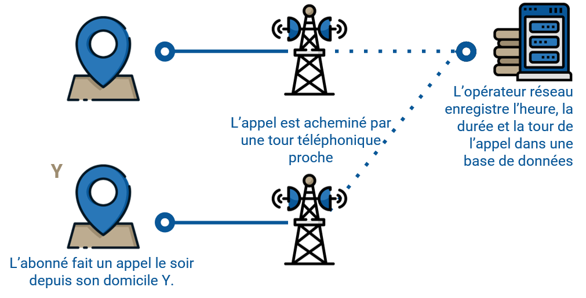

Introduction
------------

Cette page fournit une première introduction à la visualisation des
indicateurs de mobilité dérivés des enregistrements détaillés des appels
(ci-après CDRs, de l’anglais *Call detail records*). Après un bref
survol de la natures des données CDR, nous présentons un scripte R pour
visualiser. Ce travail s’incrit dans le cadre de la collaboration entre
la Fondation Flowminder, Vodacom Congo et Africell RDC pour soutenir la
riposte of COVID-19.[1]

Ces indicateurs de mobilité ont été produits par Africell RDC et la
Fondation Flowminder pour soutenir la réponse COVID-19 en RDC, avec le
soutien financier de la Division de la sécurité humaine, qui fait partie
du Département fédéral des affaires étrangères de la Confédération
suisse, ainsi que le déplacement Programme de matrice de suivi de
l’Organisation internationale pour les migrations (OIM) en République
démocratique du Congo (RDC).

Africell a exécuté les requêtes SQL *open-source* de Flowminder afin de
produire des agrégats de mobilité utilisés plus tard par Flowminder pour
dériver les indicateurs de mobilité que nous visualiserons ci-dessous.

Les dépôt GitHub où sont stockée les requêtes SQL est disponible à [ce
lien](https://github.com/Flowminder/COVID-19/tree/c9b81d2af6404af2a5c78f0b71bcee9dcc867279).

Bref aperçu des données CDRs
----------------------------

    # 
    knitr::include_graphics("img/value_chain.png")

Cycle de valeurs des données CDRs

    # 
    

Les CDRs sont générés chaque fois qu’un abonné passe ou reçoit un appel,
envoie ou reçoit un SMS ou utilise des données mobiles. Sur l’exemple
ci-contre, il n’y aurait que deux localisations dans les données CDR
d’appels: un point à l’heure du déjeuné près du lieu de travail de
l’abonné, un point le soir près de son lieu de domicile.

    # 
    knitr::include_graphics("img/cdr.png")

Exemple de données CDRs (les chiffres montrés ci-dessus sont faut)

    # 
    knitr::include_graphics("img/time_resolution.png")

La résolution temporelle des CDRs de chaque abonné dépend de sa
fréquence d’utilisation du réseau mobile.

    # 
    

La résolution spatiale des CDRs dépend dépend de la distribution
géographique des antennes relais.

De la données brut (CDRs) à un indicateur de mobilité: Aperçu du processus
--------------------------------------------------------------------------

Le schéma ci-dessous présente les étapes clés du processus. Flowminder a
fourni à Africell des requêtes SQL qui produisent les agrégats CDR à
partir des données CDR brutes. Bien que ces agrégats n’exposent aucune
information sur les abonnés individuels, ils contiennent des valeurs qui
peuvent être considérées comme commercialement sensibles, y compris le
nombre d’abonnés vus dans une région. En traitant les données et en
combinant plusieurs agrégats, nous pouvons produire des indicateurs CDR
qui ne contiennent aucune information commercialement sensible. Une fois
que les indicateurs CDR ont été produits, ils sont conçus pour être
partagés en externe avec d’autres parties prenantes, qui peuvent les
utiliser dans leur propres analyses.

Note that the `echo = FALSE` parameter was added to the code chunk to
prevent printing of the R code that generated the plot.

[1] Ce travail a été réalisé avec le soutien financier de la Division
Sécurité Humaine du Département Fédéral des Affaires Étrangères de la
Confédération Helvétique et du Programme de Matrice de Suivi de
Déplacement de la mission l’Organisation Mondiale pour les Migrations en
RDC. Le contenu de cette page relève de la seule responsabilité de la
Fondation Flowminder et ne reflète pas nécessairement les vues de la
Confédération Helvétique ou de l’Organisation Mondiale pour la
Migration.
