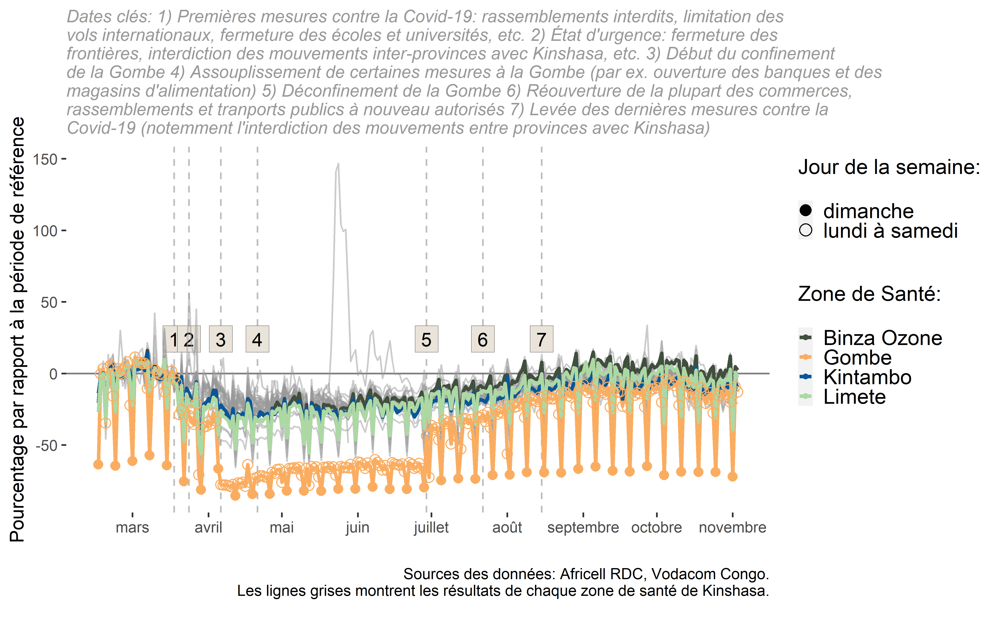

Time series of total flows
==========================

    rm(list = ls()) # clean the workspace, i.e. data loaded in R
    setwd("C:/Users/Xaviervollenweider/Documents/Flowminder/COVID/DRC/hand_over/")
    Sys.setlocale("LC_TIME", "French") # set dates to french

    ## [1] "French_France.1252"

    # load libraries
    library(dplyr) # data wrangling

    ## 
    ## Attaching package: 'dplyr'

    ## The following objects are masked from 'package:stats':
    ## 
    ##     filter, lag

    ## The following objects are masked from 'package:base':
    ## 
    ##     intersect, setdiff, setequal, union

    library(ggplot2) # plotting
    library(rgdal) # wrangling spatial data

    ## Loading required package: sp

    ## rgdal: version: 1.5-12, (SVN revision 1018)
    ## Geospatial Data Abstraction Library extensions to R successfully loaded
    ## Loaded GDAL runtime: GDAL 3.0.4, released 2020/01/28
    ## Path to GDAL shared files: C:/Users/Xaviervollenweider/Documents/R/win-library/4.0/rgdal/gdal
    ## GDAL binary built with GEOS: TRUE 
    ## Loaded PROJ runtime: Rel. 6.3.1, February 10th, 2020, [PJ_VERSION: 631]
    ## Path to PROJ shared files: C:/Users/Xaviervollenweider/Documents/R/win-library/4.0/rgdal/proj
    ## Linking to sp version:1.4-2
    ## To mute warnings of possible GDAL/OSR exportToProj4() degradation,
    ## use options("rgdal_show_exportToProj4_warnings"="none") before loading rgdal.

    library(lubridate) # managing dates

    ## 
    ## Attaching package: 'lubridate'

    ## The following objects are masked from 'package:base':
    ## 
    ##     date, intersect, setdiff, union

    # load data
    flows_or=read.csv("data/africell/afri_flow_HZ_norm_20201112.csv") # tota flows per hz
    hz_or=readOGR("data/poly/healthzones_adm1.shp") # geo boudaries and names of the admin areas

    ## OGR data source with driver: ESRI Shapefile 
    ## Source: "C:\Users\Xaviervollenweider\Documents\Flowminder\COVID\DRC\hand_over\data\poly\healthzones_adm1.shp", layer: "healthzones_adm1"
    ## with 519 features
    ## It has 11 fields

    ## Warning in readOGR("data/poly/healthzones_adm1.shp"): Z-dimension discarded

    # inspect the data
    head(flows_or)

    ##                F_id       DATE flow_OUT_norm flow_IN_norm flow_TOT_norm
    ## 1 relation/10647806 2020-02-16    -22.262316   -20.195304    -21.293464
    ## 2 relation/10647806 2020-02-17     -3.157420    -0.997299     -2.154074
    ## 3 relation/10647806 2020-02-18      0.000000     1.942655      0.894769
    ## 4 relation/10647806 2020-02-19    -25.705408   -24.485768    -25.150403
    ## 5 relation/10647806 2020-02-20      2.801584     3.693123      3.178852
    ## 6 relation/10647806 2020-02-21      7.898562    13.453148     10.561334

    dim(flows_or)

    ## [1] 11200     5

    flows_or%>%
      distinct(F_id)%>%
      summarise(n=n())

    ##    n
    ## 1 45

    flows_or%>%
      distinct(DATE)%>%
      summarise(min_date=min(DATE),
                max_date=max(DATE))

    ##     min_date   max_date
    ## 1 2020-02-16 2020-11-03

    names(hz_or)

    ##  [1] "F_id"       "attributio" "boundary"   "health_lev" "name"      
    ##  [6] "ref"        "ref_dhis2"  "source"     "type"       "ADM1_FR"   
    ## [11] "ADM1_PCODE"

    # add name of hz and province
    flows=flows_or%>%
      left_join(hz_or@data%>%
                  select(F_id,name,ADM1_FR),
                by="F_id")

    # convert DATE to a date object and create binary for Sundays
    flows=flows%>%
      mutate(DATE=as.Date(DATE),
             wdays=wday(DATE,label = T,week_start=1),
             weekdays_binary=ifelse(wdays=="dim\\.","dimanche","lundi à samedi"))

    # filter Kinshasa hz only
    flows=flows%>%
      filter(ADM1_FR=="Kinshasa")

    # name hz of interest to hilight them into the graph
    selected_HZ=c("Binza Ozone","Binza Météo","Kintambo","Gombe", "Limete")
    names(flows)

    ## [1] "F_id"            "DATE"            "flow_OUT_norm"   "flow_IN_norm"   
    ## [5] "flow_TOT_norm"   "name"            "ADM1_FR"         "wdays"          
    ## [9] "weekdays_binary"

    # Labels for key dates, will be put above the graph #####
    lockdown <- data.frame(
      date = c(
        lubridate::as_date("2020-03-18"), 
        lubridate::as_date("2020-03-24"),
        lubridate::as_date("2020-04-06"),
        lubridate::as_date("2020-04-21"),
        lubridate::as_date("2020-06-29"),
        lubridate::as_date("2020-07-22"),
        lubridate::as_date("2020-08-15")
      ),
      label = 1:7,
      type = c(
        "Premières mesures contre la Covid-19:  rassemblements interdits, limitation des vols internationaux, fermeture des écoles et universités, etc. ",
        "État d'urgence: fermeture des frontières, interdiction des mouvements inter-provinces avec Kinshasa, etc. ",
        "Début du confinement de la Gombe ",
        "Assouplissement de certaines mesures à la Gombe (par ex. ouverture des banques et des magasins d'alimentation) ",
        "Déconfinement de la Gombe ",
        "Réouverture de la plupart des commerces, rassemblements et tranports publics à nouveau autorisés ",
        "Levée des dernières mesures contre la Covid-19 (notemment l'interdiction des mouvements entre provinces avec Kinshasa)"
        
      ),
      vjust = rep(0,7)
    ) %>%
      mutate(index = paste0(label, ") ", type))

    dateCaption <- stringr::str_wrap(paste0("Dates clés: ", paste(lockdown$index, collapse = "")), 100)
    dateCaption_exec <- stringr::str_wrap(paste0("Dates clés: ", paste(lockdown$index, collapse = "")), 70)

    # define reused style for graphs background,title, legends etc  #####
    styling=theme(
      panel.grid.major.x = element_blank(),
      plot.title = element_text(family = "Merriweather Bold", size = rel(1)),
      legend.justification = c(1, 1),
      legend.spacing.y = unit(0.5, "cm"),
      legend.key.size = unit(0.3, "cm"),
      plot.subtitle = element_text(hjust = 0, face = "italic", size = rel(0.9), colour = "grey60"),
      legend.title=element_text(size=12), 
      legend.text=element_text(size=12),
      panel.background = element_rect(fill = "transparent"), # bg of the panel
      plot.background = element_rect(fill = "transparent", color = NA), # bg of the plot
      legend.background = element_rect(fill = "transparent",
                                       linetype=0), # get rid of legend bg
      legend.box.background = element_rect(fill = "transparent",
                                           linetype=0))

    # plot ####
    g=ggplot() +
      geom_vline(data = lockdown, # add vertical lines on the key dates
                 aes(xintercept = date), linetype = "dashed", colour = "grey") +
      geom_hline(yintercept = 0, colour = "grey50") + # add horizonatl line at zero (i.e. no change wrt baseline)
      geom_label( # number the vertical lines
        data = lockdown, aes(x = date, y = 15, label = label, vjust = vjust),
        label.r = unit(0, "mm"), label.size = unit(0, "mm"), fill = "#e9e3da"
      ) +
      geom_line(data = flows%>% # add timeline for each hz flow
                  filter(DATE>="2020-02-16"), # select date after 16th of Feb start of baseline)
                aes(x = DATE, y = flow_TOT_norm, # x axis is date, y axis is total flow 
                    group=name), # each line correspond to a hz identified by the name
                alpha = 0.5, colour = "grey60")+ # transparency at 50%, color of the lines is mild grey
      geom_line(data = flows%>%
                  filter(name%in%selected_HZ, # filter the hz of interest
                         DATE>="2020-02-16"),
                aes(x = DATE, y = flow_TOT_norm, 
                    group=name,colour = name), # give each hz of interest a different colour
                size=1)+
      scale_color_manual(values=c("#404F3E", "#FAAD61","#095798",  "#ADD8A4", "#C11D1D"))+ # specify the colour of the hz of interest
      geom_point(data = flows%>%  # add points in order to identify weekday from week-end
                   filter(name=="Gombe", # do it only for Gombe in order to avoid cluttering the graph
                          DATE>="2020-02-16"),
                 aes(x = DATE, y = flow_TOT_norm,
                     group=name,
                     colour=name,
                     shape=weekdays_binary), # the type of dots depends on the binary variable Weekday/Sunday
                 size=2.5) +
      scale_shape_manual(values=c(16, 1))+ # specify that Sunday are filled dot, weekday empty dots
      labs(
        x = "", # remove label from the x axis
        y = "Pourcentage par rapport à la période de référence", # label of the y axis
        colour = "Zone de Santé: ", # title for the legend for the chosen hz
        shape= "Jour de la semaine:", # title for the legend for the week day
        subtitle = dateCaption, # add the key dates description
        caption =  paste0("Sources des données: Africell RDC.\nLes lignes grises montrent les résultats de chaque zone de santé de Kinshasa.\n") #add caption
      ) +
      styling+ # add the styling definined above
      guides(shape = guide_legend(override.aes = list(size = 3)), # redefine print size of legend
             colour= guide_legend(override.aes = list(size = 1)))
    g=g+scale_x_date(date_breaks = "month", # x axis thick on month
                     date_labels = "%B") # written in full name rather than abbreviation 

    #save the plot
    ggsave(plot=g,
           paste0("out/graph/flows_timeline_kin",".png"), 
           width = 8, height = 5,
           bg="transparent",
           dpi=600)

map of presence
---------------

map of flows for one health zone
--------------------------------

map of adjacent flows
---------------------
